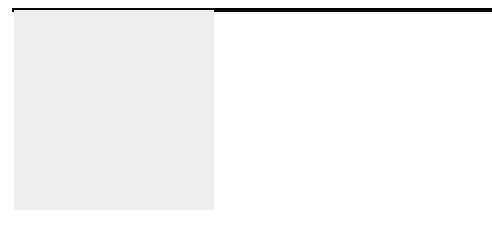
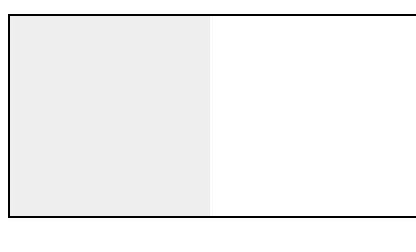

### BFC
> 块级格式化上下文
### BFC 概念
> 具有 BFC 特性的元素可以看作是隔离了的独立容器，容器里面的元素不会在布局上影响到外面的元素，并且 BFC 具有普通容器所没有的一些特性
> 通俗一点来讲，可以把 BFC 理解为一个封闭的大箱子，箱子内部的元素无论如何翻江倒海，都不会影响到外部。
### 触发 BFC
#### 只要元素满足下面任一条件即可触发 BFC 特性：
- body 根元素
- 浮动元素：float 除 none 以外的值
- 绝对定位元素：position (absolute、fixed)
- display 为 inline-block、table-cells、flex
- overflow 除了 visible 以外的值 (hidden、auto、scroll)
#### BFC 特性及应用
1. 同一个 BFC 下,外边距会发生折叠
2. BFC 可以包含浮动的元素（清除浮动）

    我们都知道，浮动的元素会脱离普通文档流，来看下下面一个例子
```
    <div style="border: 1px solid #000;">
        <div style="width: 100px;height: 100px;background: #eee;float:  left;">
        </div>
    </div>
```


由于容器内元素浮动，脱离了文档流，所以容器只剩下 2px 的边距高度。如果使触发容器的 BFC，那么容器将会包裹着浮动元素。
```
<div style="border: 1px solid #000;overflow: hidden">
        <div style="width: 100px;height: 100px;background: #eee;float: left;">
    </div>
</div>
```
效果如图：



3. BFC 可以阻止元素被浮动元素覆盖


